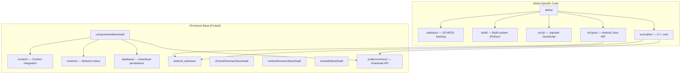
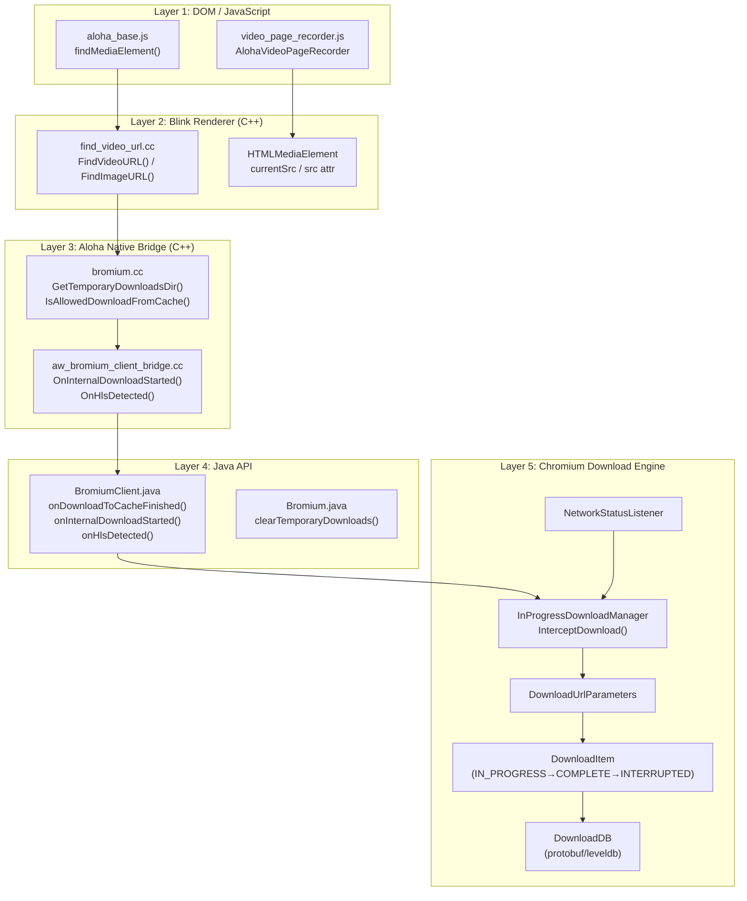
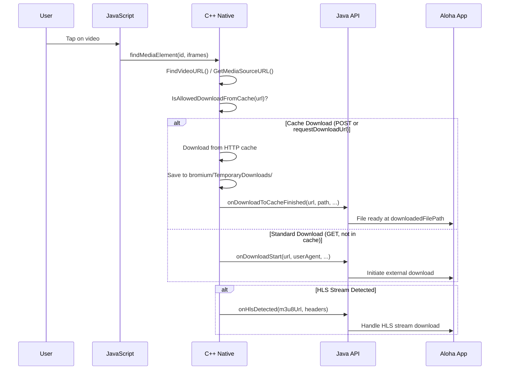
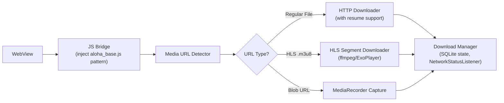

# Aloha Core — Complete Repository Analysis & Download Mechanism Deep Dive

> **Repo**: [AlohaBrowser/aloha-core](https://github.com/AlohaBrowser/aloha-core) (branch `abr-146.0.7680.153`)
> **Purpose**: Browser web engine (Chromium fork) powering Aloha Browser on Android, iOS, Windows, macOS
> **Languages**: C++ (73.6%), Java (9%), Obj-C++ (4.8%), TypeScript (4.2%), HTML (2.5%)
> **License**: BSD-3-Clause
> **Stars/Forks**: 85 / 20

---

## 1. Repository Architecture Overview



### Top-Level Directory Map

| Directory | What It Is |
|-----------|-----------|
| `aloha/` | **All Aloha-specific modifications** — the custom layer on top of Chromium |
| `components/download/` | Chromium's download component (database, network, public API) |
| `chrome/browser/download/` | Chrome-specific download UI & management |
| `content/browser/download/` | Content-layer download implementation |
| `ios/web/download/` | iOS download using `WKDownload` |
| `android_webview/` | Android WebView (Aloha builds on this) |
| `base/`, `net/`, `media/`, `mojo/` | Core Chromium infrastructure |

---

## 2. The `aloha/` Directory — Aloha's Custom Code

This is the **most important directory** — it contains everything Aloha added on top of Chromium.

### 2.1 Build System (`aloha/build/`)

| File | Purpose |
|------|---------|
| `build_webview.py` | Builds the Android WebView AAR for specific architectures |
| `make_aar.py` | Packages the build into an AAR (Android Archive) |
| `gen_build_cfg.py` | Generates GN build configurations |
| `config.py` | Build configuration constants |
| `docker_utils.py` | Docker-based build environment |
| `build_clean_release.py` | Clean release builds in Docker |

> [!IMPORTANT]
> Aloha distributes as an **AAR library** (`make_aar.py`), meaning their app consumes the web engine as a packaged dependency — a pattern worth noting for Chaya.

### 2.2 Native C++ Layer (`aloha/src/native/`)

This is the core of Aloha's custom functionality. Every file here is Aloha-original code:

#### Core Files

| File | Purpose |
|------|---------|
| [bromium.cc](file:///c:/Users/user/chaya/aloha-core-study/aloha-core/aloha/src/native/bromium.cc) | **Main entry point** — JNI bridge, temp downloads dir, cache-download gating, clear functions |
| [bromium_client_bridge.h](file:///c:/Users/user/chaya/aloha-core-study/aloha-core/aloha/src/native/bromium_client_bridge.h) | **Abstract interface** defining callbacks from C++ → Java (media events, download events, HLS) |
| [aw_bromium_client_bridge.cc](file:///c:/Users/user/chaya/aloha-core-study/aloha-core/aloha/src/native/aw_bromium_client_bridge.cc) | **Concrete implementation** that calls Java via JNI |
| [aloha_consts.h](file:///c:/Users/user/chaya/aloha-core-study/aloha-core/aloha/src/native/aloha_consts.h) | Constants — HTTP cache limits (150MB), cookie managers, download origin |
| [find_video_url.cc](file:///c:/Users/user/chaya/aloha-core-study/aloha-core/aloha/src/native/find_video_url.cc) | **Video URL extraction** from DOM tree (traverses shadow DOM, iframes) |
| [fullscreen_state_handler.h](file:///c:/Users/user/chaya/aloha-core-study/aloha-core/aloha/src/native/fullscreen_state_handler.h) | Manages fullscreen video state for player-specific behavior |

#### Player Implementations (`aloha/src/native/player/`)

| File | Purpose |
|------|---------|
| `player_base.h` | Abstract player interface (EnterFullscreen, ExitFullscreen, GetType) |
| `player_youtube.cc/h` | YouTube-specific player handling |
| `player_jw.cc/h` | JW Player-specific handling |
| `player_base_impl.cc/h` | Default player implementation |
| `type.h` | Enum: `kYouTube`, `kJwPlayer`, `kBase`, `kUnknown` |

### 2.3 Java API Layer (`aloha/src/java/`)

| File | Purpose |
|------|---------|
| [Bromium.java](file:///c:/Users/user/chaya/aloha-core-study/aloha-core/aloha/src/java/com/alohamobile/bromium/Bromium.java) | **Public API** — version info, media controls, temp downloads, crypto signatures |
| [BromiumClient.java](file:///c:/Users/user/chaya/aloha-core-study/aloha-core/aloha/src/java/com/alohamobile/bromium/BromiumClient.java) | **Abstract callback interface** — all events the app receives |
| [BromiumClientBridge.java](file:///c:/Users/user/chaya/aloha-core-study/aloha-core/aloha/src/java/com/alohamobile/bromium/BromiumClientBridge.java) | JNI bridge that forwards native C++ events to `BromiumClient` |
| `BromiumInitializer.java` | Engine initialization |
| `BromiumResources.java` | Resource management |
| `BromiumUI.java` | UI components |
| `StartJavaScript.java` | JS injection management |
| `SwipeRefreshHandler.java` | Pull-to-refresh |
| `SelectionPopupHandler.java` | Text selection UI |

### 2.4 Injected JavaScript (`aloha/src/js/`)

| File | Purpose |
|------|---------|
| [aloha_base.js](file:///c:/Users/user/chaya/aloha-core-study/aloha-core/aloha/src/js/aloha_base.js) | Chrome compat shim + `findMediaElement()` for Shadow DOM traversal |
| `aloha_id.js` | Element identification system |
| `apm.js` | Application Performance Monitoring |
| [video_frame_overlay.js](file:///c:/Users/user/chaya/aloha-core-study/aloha-core/aloha/src/js/video_frame_overlay.js) | Animated glowing frame overlay for video recording UI |
| [video_page_recorder.js](file:///c:/Users/user/chaya/aloha-core-study/aloha-core/aloha/src/js/video_page_recorder.js) | `AlohaVideoPageRecorder` — MediaRecorder-based video capture |
| `readability.js` | Reader mode (Readability.js) |

---

## 3. Download Mechanism — Complete Deep Dive

> [!NOTE]
> Aloha's download system operates across **5 interconnected layers**, from DOM inspection down to persistent storage.

### 3.1 Architecture Overview



### 3.2 Layer-by-Layer Breakdown

---

#### Layer 1: DOM Video/Image URL Detection

**JavaScript Side** ([aloha_base.js](file:///c:/Users/user/chaya/aloha-core-study/aloha-core/aloha/src/js/aloha_base.js)):

```javascript
// Traverses Shadow DOM + iframes to find media elements by aloha_id
function findMediaElement(mediaId, iframeIds) {
    let doc = document;
    for (const iframeId of iframeIds) {
        // Navigate through nested iframes via aloha_id attributes
        const iframeEl = doc.querySelector("[aloha_id=\"" + iframeId + "\"]");
        if (iframeEl?.contentDocument) {
            doc = iframeEl.contentDocument;
        } else {
            // Fallback: search shadow DOM
            doc = findIframeInShadowDOM(iframeId, doc);
        }
    }
    // Find VIDEO elements with matching aloha_id
    elems = doc.querySelectorAll("[aloha_id=\"" + mediaId + "\"]");
    for (const elem of elems) {
        if (elem.tagName == "VIDEO") return elem;
    }
    return findShadowElementByAlohaId(mediaId, doc);
}
```

> [!TIP]
> **Key Insight for Chaya**: Aloha assigns `aloha_id` attributes to media elements and uses these to track them across DOM mutations, shadow roots, and iframes. This is essential for reliable video download detection on modern web pages.

**C++ Side** ([find_video_url.cc](file:///c:/Users/user/chaya/aloha-core-study/aloha-core/aloha/src/native/find_video_url.cc)):

The C++ renderer-process code performs a **breadth-first DOM traversal** to find video/image elements:

```cpp
// Traverse settings control the search scope
constexpr TraverseSettings find_url_settings{200, 10};  // max 200 elements, 10 parent levels
constexpr TraverseSettings foreach_settings{2000, 2};   // BBC needs ~1750 elements

// Finds video URL near a specific viewport point
KURL FindVideoURL(const Node* node, const gfx::Point& point_in_viewport) {
    return FindURL<HTMLVideoElement>(node, point_in_viewport,
        [](const auto& elem) { return GetMediaSourceURL(elem); });
}

// Extracts media source from element or descendants
KURL GetMediaSourceURL(const Element& elem) {
    // 1. Check HTMLMediaElement.currentSrc
    if (auto* media = DynamicTo<HTMLMediaElement>(elem)) {
        if (!media->currentSrc().IsEmpty()) return media->currentSrc();
    }
    // 2. Check 'src' attribute
    // 3. Recurse into children
    // 4. Recurse into Shadow Root children
}
```

> [!IMPORTANT]
> **The traversal handles**: regular DOM children, Shadow DOM (`GetShadowRoot()`), and cross-document iframes (`contentDocument()`). It stops at `<article>` or `<body>` tags to avoid over-scanning.

---

#### Layer 2: Cache-Based Download System

**The core innovation** — Aloha downloads media from the HTTP cache, not by re-requesting:

```cpp
// bromium.cc — Temporary download storage
base::FilePath GetTemporaryDownloadsDir() {
    return GetPathInAppDirectory("bromium/TemporaryDownloads");
}

// Domain blacklist for cache downloads (e.g., Instagram blocked)
bool IsAllowedDownloadFromCache(const GURL& site_url) {
    constexpr std::string_view blacklist[] = { "instagram.com" };
    // Returns false if domain matches blacklist
}
```

```cpp
// aloha_consts.h — Cache configuration
constexpr char kDownloadRequestOrigin[] = "Aloha download";
constexpr int kHttpCacheMaxSizeBytes = 150 * 1024 * 1024;  // 150 MB
constexpr int kHttpCacheFileRatio = 8;
constexpr int kHttpCacheMaxFileSizeBytes = kHttpCacheMaxSizeBytes / kHttpCacheFileRatio;  // ~18.75 MB
```

> [!CAUTION]
> The cache-based download has a **max file size of ~18.75 MB** per file. Files larger than this won't be in the HTTP cache and will fall back to standard download via `onDownloadStart()`.

---

#### Layer 3: Native → Java Bridge

**C++ → Java event flow** ([aw_bromium_client_bridge.cc](file:///c:/Users/user/chaya/aloha-core-study/aloha-core/aloha/src/native/aw_bromium_client_bridge.cc)):

```cpp
// When Chromium starts handling a download internally
void AwBromiumClientBridge::OnInternalDownloadStarted(
    const std::string& http_method, int size_in_bytes) {
    // Forwards to Java: BromiumClientBridge.onInternalDownloadStarted()
}

// When HLS stream (.m3u8) is detected in network traffic
void AwBromiumClientBridge::OnHlsDetected(
    const std::string& url, const std::string& request_headers) {
    // Forwards to Java: BromiumClientBridge.onHlsDetected()
    // request_headers in JSON format
}
```

---

#### Layer 4: Java Callback Interface

**The complete download API** ([BromiumClient.java](file:///c:/Users/user/chaya/aloha-core-study/aloha-core/aloha/src/java/com/alohamobile/bromium/BromiumClient.java)):

```java
public abstract class BromiumClient {
    // Download Events
    
    /** Called when Chromium handles a download internally */
    public abstract void onInternalDownloadStarted(
        String httpMethod,   // "GET" or "POST"
        int sizeInBytes      // file size
    );

    /** Called when cache-based download completes (POST downloads or requestDownloadUrl) */
    public abstract void onDownloadToCacheFinished(
        String url,                // Final URL after redirects
        String originalUrl,        // Original URL
        String userAgent,
        String contentDisposition,
        String mimeType,
        String suggestedFilename,  // Chromium's filename suggestion
        String downloadedFilePath  // Path to temp file with content
    );

    /** Internal state tracking for download URL requests */
    public abstract void onRequestedDownloadUrl(String url);

    /** Called when HLS stream is detected */
    public abstract void onHlsDetected(
        String url,            // .m3u8 URL
        String requestHeaders  // JSON format headers
    );

    // Media Events (related to download)
    public abstract void onMediaPlay(MediaPlayerId playerId, 
        String mediaUrl, String documentUrl, 
        double durationSec, boolean isAudioOnly);
    public abstract void onMediaPause(...);
    public abstract void onMediaDestroy(...);
    public abstract void onMediaError(...);
}
```

**Download Lifecycle Flow**:



---

#### Layer 5: Chromium Download Engine

**`InProgressDownloadManager`** ([in_progress_download_manager.h](file:///c:/Users/user/chaya/aloha-core-study/aloha-core/components/download/public/common/in_progress_download_manager.h)):

Aloha modified this file with a key hook:

```cpp
class Delegate {
    // ALOHA modification — intercept downloads before they hit the standard path
    virtual bool InterceptDownload(DownloadCreateInfo& download_create_info);
};
```

This `InterceptDownload` hook is how Aloha **redirects downloads** to their cache-based system or the app's custom handler.

**`DownloadItem` States**:

| State | Meaning |
|-------|---------|
| `IN_PROGRESS` | Actively downloading |
| `COMPLETE` | Finished successfully |
| `CANCELLED` | User or system cancelled |
| `INTERRUPTED` | Network error, can resume |

**Key `DownloadUrlParameters` settings** used by Aloha:

```cpp
params->set_prefer_cache(true);        // Use HTTP cache if available
params->set_post_id(post_id);          // For POST request cache lookups
params->set_request_origin("Aloha download");  // Identify Aloha downloads
params->set_file_path(temp_dir / filename);    // Save to temp directory
```

**Download Persistence** (`components/download/database/`):
- Uses **protobuf + LevelDB** for download state persistence
- `DownloadDBEntry` stores download metadata
- Survives app restarts for resume capability

**Network Awareness** (`components/download/network/`):
- `NetworkStatusListener` monitors connection type changes
- Downloads auto-pause on network loss and resume when restored

---

### 3.3 Video Recording System (Separate from Downloads)

Aloha also has a **MediaRecorder-based video recording** system ([video_page_recorder.js](file:///c:/Users/user/chaya/aloha-core-study/aloha-core/aloha/src/js/video_page_recorder.js)):

```javascript
class AlohaVideoPageRecorder {
    static start(playerId, iframeIds, config) {
        // 1. Find video element via findMediaElement()
        // 2. Capture stream via video.captureStream(fps)
        // 3. Start MediaRecorder with optimal codec/bitrate
        // 4. Save chunks as blob downloads every 3 seconds
        // 5. Show animated red glow overlay (VideoFrameOverlay)
    }
}
```

This saves chunks as `__aloha_recording_chunk__<timestamp>_<N>.webm` files using `<a download>` trick.

---

## 4. iOS Download System

The iOS side uses **WKDownload** (WebKit's native download API):

| File | Purpose |
|------|---------|
| `download_task_impl.h` | Base implementation with state machine (kNotStarted → started → done) |
| `download_native_task_bridge.h` | Obj-C bridge wrapping `WKDownload` with progress/response/complete callbacks |
| `download_session_cookie_storage.mm` | Cookie handling for authenticated downloads |
| `web_state_content_download_task.h` | Content-based download from WebState |

Key callbacks:
```objc
NativeDownloadTaskProgressCallback  // bytes_received, total_bytes, fraction
NativeDownloadTaskResponseCallback  // http_code, mime_type, redirect_url
NativeDownloadTaskCompleteCallback  // DownloadResult (success/error)
```

---

## 5. Key Takeaways for Chaya

### What You Can Directly Reuse

1. **Video URL Detection Pattern**: The DOM traversal strategy (Shadow DOM + iframes + `aloha_id` attributes) is the gold standard for finding media on modern websites
2. **Cache-Based Download**: Serving media from HTTP cache instead of re-downloading saves bandwidth and avoids CORS/auth issues
3. **HLS Detection**: Intercepting `.m3u8` streams at the network layer for separate handling
4. **Domain Blacklisting**: Simple but effective pattern for blocking downloads from specific sites (legal compliance)
5. **Player-Specific Handling**: YouTube and JW Player need different fullscreen/control strategies — plan for this

### Architecture Recommendations for Chaya



### Critical Constants to Know

| Constant | Value | Why It Matters |
|----------|-------|----------------|
| HTTP Cache Max Size | 150 MB | Limits what can be served from cache |
| Max Cache File Size | ~18.75 MB | Single file cache limit |
| DOM Traverse Limit | 200 elements | Prevents hanging on huge DOMs |
| Parent Level Limit | 10 levels | Stops at `<body>` or `<article>` |
| Recording Chunk Interval | 3 seconds | Balances quality vs. data safety |

---

## 6. Files Cloned Locally

All files are at `c:\Users\user\chaya\aloha-core-study\aloha-core\` with sparse checkout of:
- `aloha/` — Complete Aloha-specific code
- `components/download/` — Chromium download component
- `ios/web/download/` — iOS download implementation
- `ios/chrome/browser/download/` — iOS Chrome download
- `chrome/browser/download/` — Chrome download management
- `content/browser/download/` — Content-layer downloads
- `content/public/browser/` — Public browser APIs
